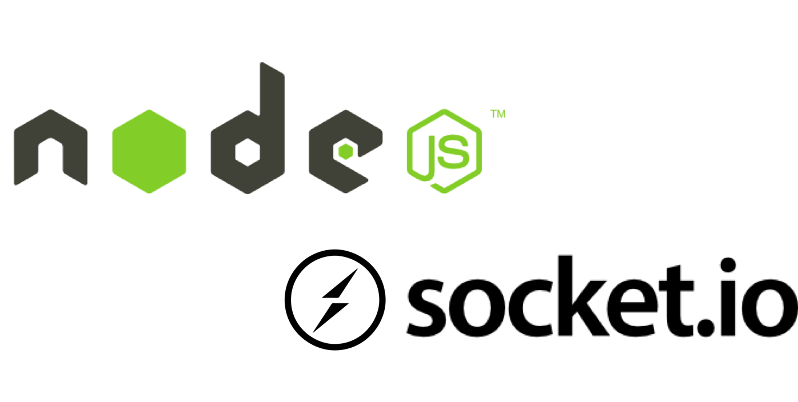
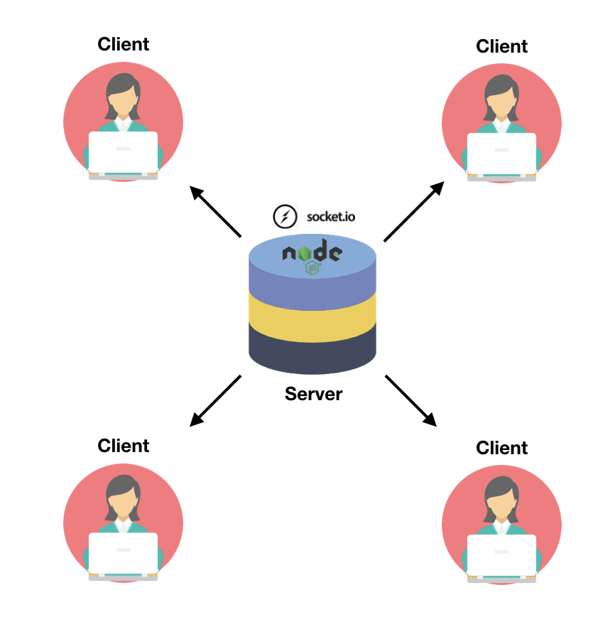
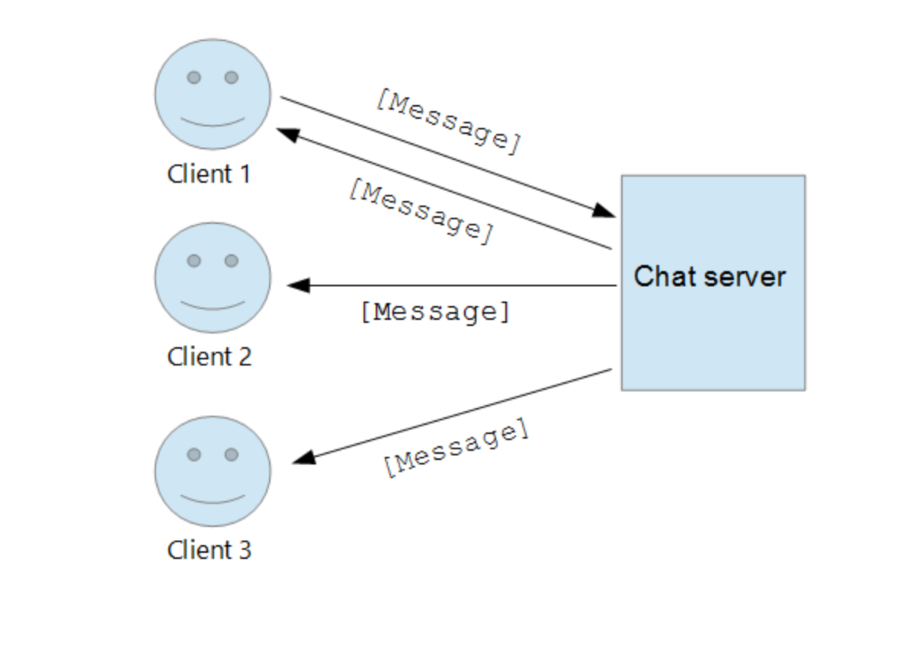
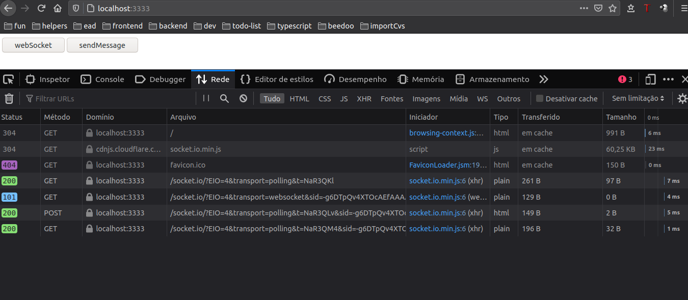
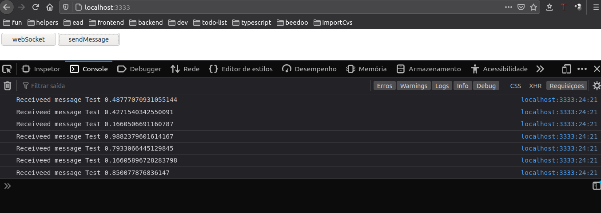

<h1 align="center">
  <a href="#" alt="">Node + Socket.io</a>
</h1>
<p align="center" style="display: flex; align-items: flex-start; justify-content: center;">

 
<h4 align="center">
🚧Concluído 🚀🚧
</h4>
 
Tabela de conteúdos
=================
<!--ts-->
 * [Sobre o projeto](#-sobre-o-projeto)
 * [Layout](#-layout)
 * [Como executar o projeto](#-como-executar-o-projeto)
 * [Tecnologias](#-tecnologias)
 
<!--te-->
 
## 💻 Sobre o projeto
 
Projeto baseado no vídeo da [rocketseat](https://rocketseat.com.br), onde fala em qual situação se deve, ou não utilizar o real time segue o vídeo [Node para APIs em real time? - #PR​ 35](https://www.youtube.com/watch?v=HrkECIzaQvE).
 
### Para esse processo ele usa o [soket.io](https://socket.io/). Mas o que é ?
 
Socket.IO é uma biblioteca, para aplicativos da web em tempo real. 

Permite comunicação bidirecional em tempo real entre clientes e servidores da Web.
Ele tem duas partes: uma biblioteca do lado do cliente que é executada no navegador e uma biblioteca do lado do servidor para o Node.js.
 
<p align="center" style="display: flex; align-items: flex-start; justify-content: center;">

 

</p>
 
 
#### ⚙️ Funcionalidades

- [x] Comunicação em tempo real entre, clientes e servidores.
- [x] Fornece automaticamente id único para clientes e servidores.
- [x] Facilmente recarrega, por exemplo queda de energia
- [x] Não faz requisição além, do necessário

---

## 🎨 Layout

O layout da aplicação:

<p align="center" style="display: flex; align-items: flex-start; justify-content: center;">

</p>

<p align="center" style="display: flex; align-items: flex-start; justify-content: center;">

</p>

<p align="center" style="display: flex; align-items: flex-start; justify-content: center;">

</p>

---

## 🚀 Como executar o projeto
 
### Pré-requisitos
 
Antes de começar, você vai precisar ter instalado em sua máquina as seguintes ferramentas:
[Git](https://git-scm.com), [Node.js](https://nodejs.org/en/).
 
Além disto é bom ter um editor para trabalhar com o código como [VSCode](https://code.visualstudio.com/)
 
#### 🎲 Rodando o projeto
```bash
# Clone este repositório
$ git clone git@github.com:leandrojsantos/node-realtime.git
# Acesse a pasta do projeto no terminal/cmd
$ cd node-realtime
# Instale as dependências
$ yarn
# Caso não tenha gerado a tsconfig.json
$ yarn tsc --init


# Na raiz do projeto e use comando para rodar o servidor
$ yarn start

# O start é na porta localhost:3333

```
## 🛠 Tecnologias
As seguintes ferramentas foram usadas na construção do projeto:
* [Express](https://expressjs.com/pt-br/) para o servidor
* [Node.js](https://nodejs.org/en/) para o desenvolvimento
* [Soket.io](https://socket.io/) para o real time
* [Typescript](https://www.typescriptlang.org/) para o desenvolvimento
 
### Na parte do Server/Client:
```bash
  "dependencies": {
   "express": # biblioteca para restfull
   "socket.io": # biblioteca para comunicação em tempo real
   "tsc": # biblioteca para 'reload autimatic' no typescript
 },
 "devDependencies": {
   "@types/express": # biblioteca do typescript
   "ts-node-dev": # biblioteca do typescript
   "typescript": # biblioteca do typescript
 }